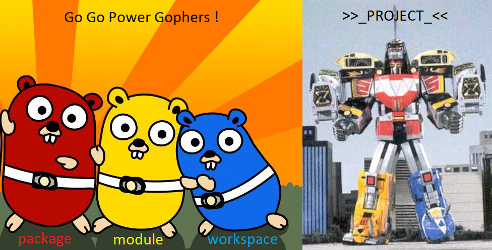
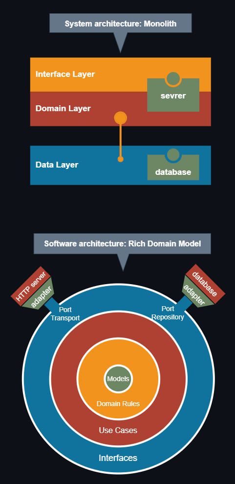
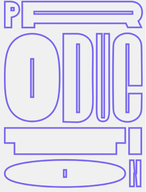
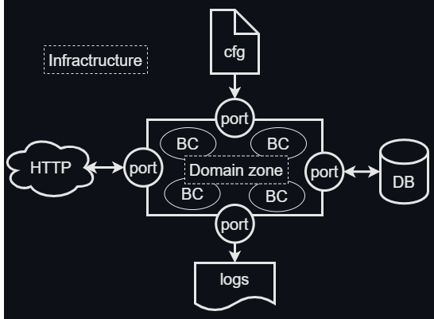
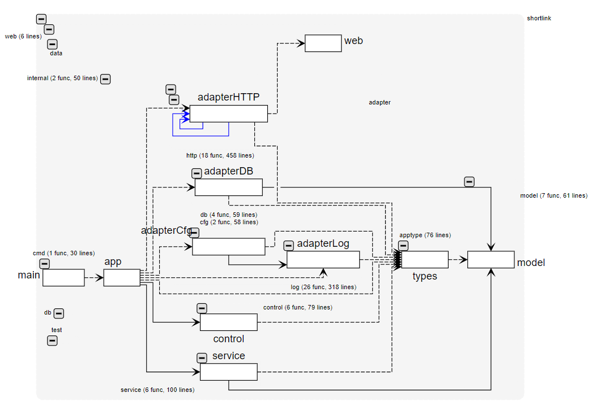
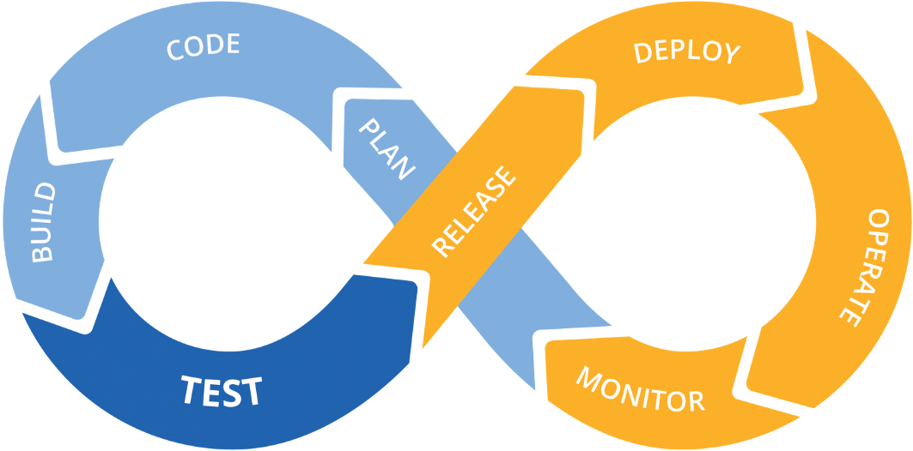
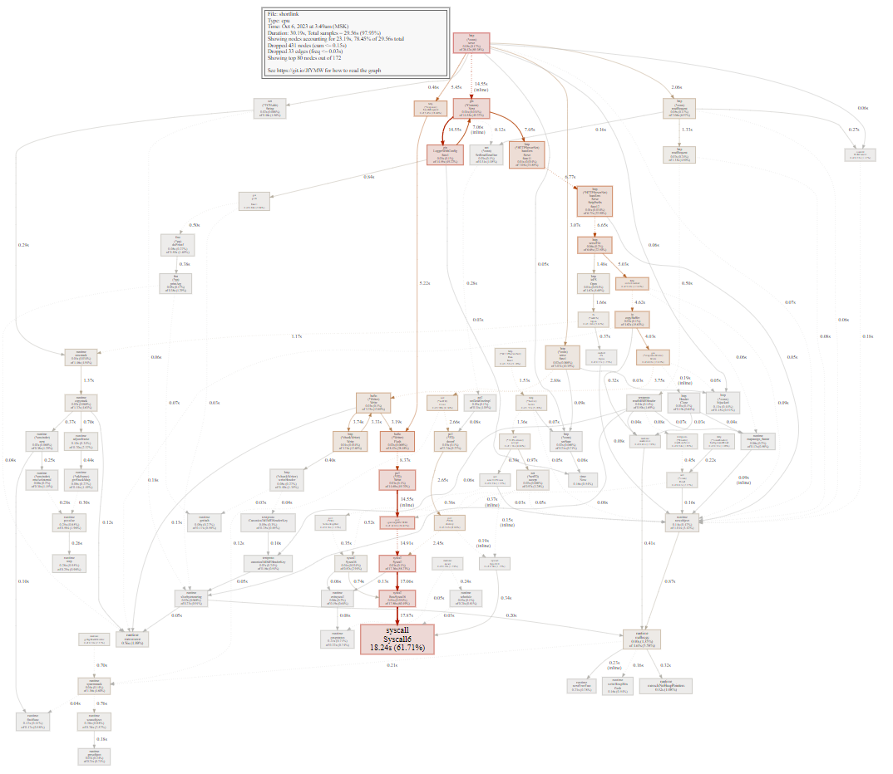
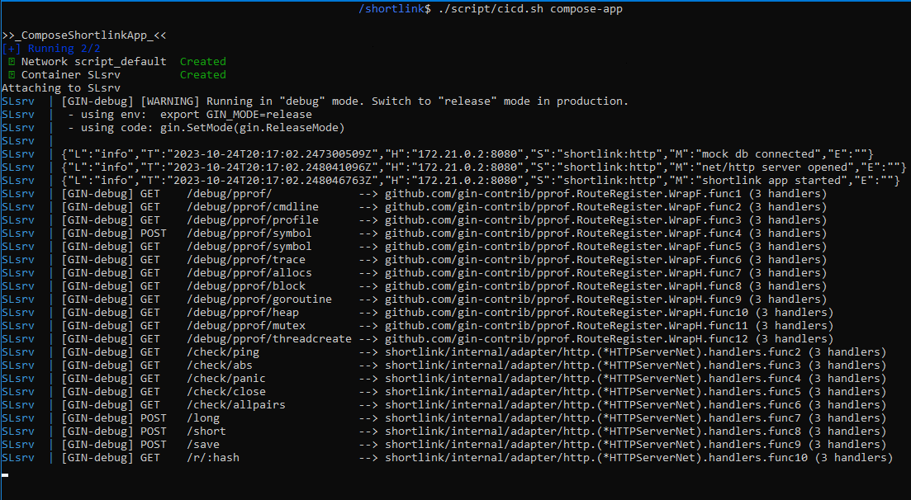
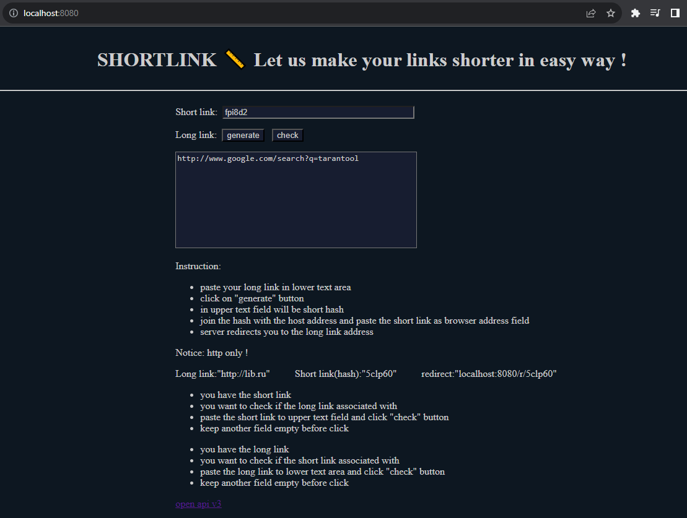

<p align="left">
  
	
	
	<a href="https://github.com/kselnaag/shortlink/blob/master/LICENSE" title="LICENSE"></a>
	<a href="https://github.com/kselnaag/shortlink/actions" title="Workflows"></a>
</p>

### **SHORTLINK** 📏 Let us make your links shorter in easy way !
----

## **📜 Description**
This is a test project to generate the short link from the long link you already have. We want to be able to:


- get the short link from the long link
- save the result to database
- redirect from the short link to the long link destination
- get simple UI as HTML page
- check if the long link HTTP valid

## **🔬 Analysis**
We choose Monolith as system arch pattern and Rich Domain Model as software arch pattern. Let us look at some architect points:


- `Adapters`
  - HTTP transport with static file server
  - SQL or NoSQL database
  - JSON logger
  - file + env config
- `Interfaces`
  - http
  - db
  - log
  - service
- `Controllers`
  - http
  - db
- `Services`
  - redirect from short link to long link
  - search the short link if you have a long link
  - search the long link if you have a short link
  - get ALL link pairs presented in db (test functional)
  - check if long link HTTP available
- `Models`
  - link pair (string, string)
  - compute short link from long link
  - unite short link and long link
  - check if pair is valid

## **💡 Solution notes**


- layering and hexagonal arch
- standart go project layout (more or less)
- pre-commit hooks and github actions (CI) + docker-compose (CD) + minikube (prod🙃)
- integration tests and unit tests with mocks
- e2e tests with PLY
- HTTPfast(fiber) or HTTPnet(gin) server adapters
- logZero, logSlog or logFprintf logger adapters
- postgreSQL, redis, mongoDB or tarantool db adapters
- OpenAPI Swagger docs `http://localhost:8080/oapi`

## **🛠️ Libs and tools**


- `Libs (https://github.com/)`
  - caarlos0/env v3.5.0
  - joho/godotenv v1.5.1
  - rs/zerolog v1.29.0
  - gin-gonic/gin v1.9.0
  - gin-contrib/static v0.0.1
  - gin-contrib/pprof v1.4.0
  - valyala/fasthttp v1.45.0
  - gofiber/fiber v2.42.0
  - stretchr/testify v1.8.2
  - gavv/httpexpect v2.15.0
  - jackc/pgx v5.4.3
  - mongodb/mongo-go-driver v1.12.1
  - redis/go-redis v9.2.1
  - tarantool/go-tarantool v2.0.0
- `Tools`
  - golang v1.21
  - golangci-lint v1.51.2
  - curl v7.68.0
  - ply v3.2.14 (vscode extension)
  - apache benchmark v2.3 (apache2-utils)
  - docker v24.0.6 + docker-compose v2.21.0
  - minikube v1.31.2

## **📊 Metrics**

<p align="right">Package graph


</p>


- `Project metrics`
  - Code size + Repository size
  - Package graph (image_packages)
  - Control-flow graph (go tool pprof)
  - Unit test coverage (go tool cover)
  - Lines of code (gcloc, complexity)
  - Cyclomatic complexity (gocyclo, complexity)
  - Cognitive Complexity (gocognit)
  - Halstead complexity (complexity)
  - Maintainability index (complexity)
- `Metrics repos (https://github.com/)`
  - ManyakRus/image_packages
  - JoaoDanielRufino/gcloc
  - fzipp/gocyclo
  - uudashr/gocognit
  - kselnaag/go-complexity-analysis (fork)

More details in: `./script/metrics/`

## **⚙️ HowTo**


- check if `docker` and `docker-compose` has been installed and works
- clone the project `git clone https://github.com/kselnaag/shortlink`
- dive into a folder `cd shortlink`
- build all localy with `./script/cicd.sh docker-build` 
- check if `kselnaag/shortlink` built correctly: `docker images`
- run everything with `./script/cicd.sh compose-app` (mock DB)
- if you want to use some DBs pick "compose-pg" or "compose-mg" or "compose-rd" or "compose-tt"
- go to `http://localhost:8080` in your browser and try it

In case of additional flexibility situation change YAML configs in `./script/` guided by `./config/shortlink.env`

Kube deploy in `./script/kube/`

## **🦋 The beauty is like this and nothing more**

```
kselnaag:~/shortlink$ ./script/cicd.sh

CI/CD COMMANDS: style lint test build run start check check-no-lint
                itest-tt itest-rd itest-pg itest-mg
                docker-gobuilder docker-build docker-up docker-stop
                compose-app compose-pg compose-rd compose-mg compose-tt
                metrics metrics-graph
EXAMLPE:        ./script/cicd.sh build

kselnaag:~/shortlink$ ./script/cicd.sh metrics

>>_TestCoverage_<<
?       shortlink/cmd                   [no test files]
?       shortlink/internal              [no test files]
ok      shortlink/internal/adapter/cfg  0.043s  coverage: 53.8% of statements
ok      shortlink/internal/adapter/db   0.024s  coverage: 0.0% of statements
?       shortlink/internal/apptype      [no test files]
?       shortlink/internal/control      [no test files]
?       shortlink/web                   [no test files]
ok      shortlink/internal/adapter/http 0.063s  coverage: 58.5% of statements
ok      shortlink/internal/adapter/log  0.020s  coverage: 77.0% of statements
ok      shortlink/internal/model        0.017s  coverage: 100.0% of statements
ok      shortlink/internal/service      0.039s  coverage: 71.8% of statements
TOTAL: 72.2%

>>_LinesOfCode_<<
  Language   | Files | Lines | Blank lines | Comments | Code lines
  Golang     |    33 |  2515 |         279 |       43 |       2193
  Bash       |     1 |   362 |          40 |        3 |        319

>>_CyclomaticComplexity_<<
Average: 2.57

>>_CognitiveComplexity_<<
Average: 1.94

>>_ComplexityMetrics_<<
TOTAL LoC: 1849
TOTAL cycloAvg: 2.62609
TOTAL halstVolAvg: 432.956
TOTAL halstDiffAvg: 23.6937
TOTAL maintAvg: 61.0348

>>_Successfull_<<
```

Control-flow graph (for `http://localhost:8080/`)




Notice: http only !
 
----
### **🔗 LINKS**
| [gin](https://github.com/gin-gonic/gin "https://github.com/gin-gonic/gin")
| [gin docs](https://gin-gonic.com/docs/ "https://gin-gonic.com/docs/")
|             
| [zerolog](https://github.com/rs/zerolog "https://github.com/rs/zerolog")
|                    
| [tarantool](https://hub.docker.com/r/tarantool/tarantool "https://hub.docker.com/r/tarantool/tarantool")
| [tarantool docs](https://www.tarantool.io/ru/doc/ "https://www.tarantool.io/ru/doc")
|         
| [postgres](https://hub.docker.com/_/postgres "https://hub.docker.com/_/postgres")
| [postgres docs](https://www.postgresql.org/docs/16/ "https://www.postgresql.org/docs/16/")
| 

| [fiber](https://github.com/gofiber/fiber "https://github.com/gofiber/fiber")
| [fiber docs](https://docs.gofiber.io "https://docs.gofiber.io")
|         
| [godotenv](github.com/joho/godotenv "github.com/joho/godotenv")
| [env](https://github.com/caarlos0/env "https://github.com/caarlos0/env")
|        
| [redis](https://hub.docker.com/_/redis "https://hub.docker.com/_/redis")
| [redis docs](https://redis.io/docs/ "https://redis.io/docs/")
|                      
| [mongoDB](https://hub.docker.com/_/mongo "https://hub.docker.com/_/mongo")
| [mongoDB docs](https://www.mongodb.com/docs/manual/ "https://www.mongodb.com/docs/manual/")
|
