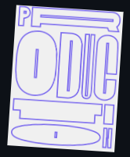
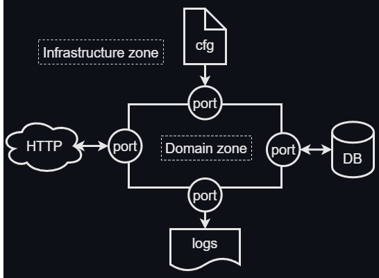

	
	
	
	

  
	
	

### **SHORTLINK** 📏 Let us make your links shorter in easy way !
----

## **🧾Description**
This is a test project to generate the short link from the long link you already have. We want to be able to:

- get the short link from the long link
- save the result to database
- redirect from the short link to the long link destination
- get simple UI as HTML page
- check if the long link HTTP valid

## **📊Analysis**
We choose Monolith as system arch pattern and Rich Domain Model as software arch pattern. Let us look at some architect points:

- `Domain Adapters`
  - HTTP transport
  - SQL database
  - JSON logger
  - file + env config
- `Use Cases`
  - get healthcheck
  - get html UI
  - redirect from short link to long link 
  - search the short link if you have a long link
  - search the long link if you have a short link
  - get ALL link pairs presented in db
  - check if long link HTTP available
- `Domain Rules`
  - compute short link from long link
  - unite short link and long link
  - check if pair is valid
- `Domain Models`
  - link pair (string, string)

## **💡Solution notes**

- clean arch + DDD aproach
- standart go project layout (more or less)
- pre-commit hooks and github actions (CI) + podman-compose (CD) + minikube (prod🙃)
- tests with mocks included
- tarantool migrations and TTL records included

## **🛠️Libs and tools**

- `Libs (github.com)`
  - caarlos0/env v3.5.0
  - joho/godotenv v1.5.1
  - rs/zerolog v1.29.0
  - gin-gonic/gin v1.9.0
  - gin-contrib/static v0.0.1
  - valyala/fasthttp v1.45.0
  - gofiber/fiber/v2 v2.42.0
  - stretchr/testify v1.8.2
  - gavv/httpexpect v2.15.0
- `Tools`
  - golangci-lint
  - curl 
  - podman + podman-compose
  - minikube

## **⚙️HowTo**

- check if `podman` and `podman-compose` has been installed
- clone the project
- run everything with `./script/run.sh`
- go to `http://localhost:8080` in your browser and try it

## **🦋The beauty is like this and nothing more**

----
### **🔗LINKS**
| [gin](https://github.com/gin-gonic/gin "https://github.com/gin-gonic/gin")
| [gin docs](https://gin-gonic.com/docs/ "https://gin-gonic.com/docs/")
|             
| [zerolog](https://github.com/rs/zerolog "https://github.com/rs/zerolog")
|                    
| [tarantool](https://hub.docker.com/r/tarantool/tarantool "https://hub.docker.com/r/tarantool/tarantool")
| [tarantool docs](https://www.tarantool.io/ru/doc/ "https://www.tarantool.io/ru/doc")
| 

| [fiber](https://github.com/gofiber/fiber "https://github.com/gofiber/fiber")
| [fiber docs](https://docs.gofiber.io "https://docs.gofiber.io")
|         
| [godotenv](github.com/joho/godotenv "github.com/joho/godotenv")
| [env](https://github.com/caarlos0/env "https://github.com/caarlos0/env")
|        
| [redis](https://hub.docker.com/_/redis "https://hub.docker.com/_/redis")
| [redis docs](https://redis.io/docs/ "https://redis.io/docs/")
|

